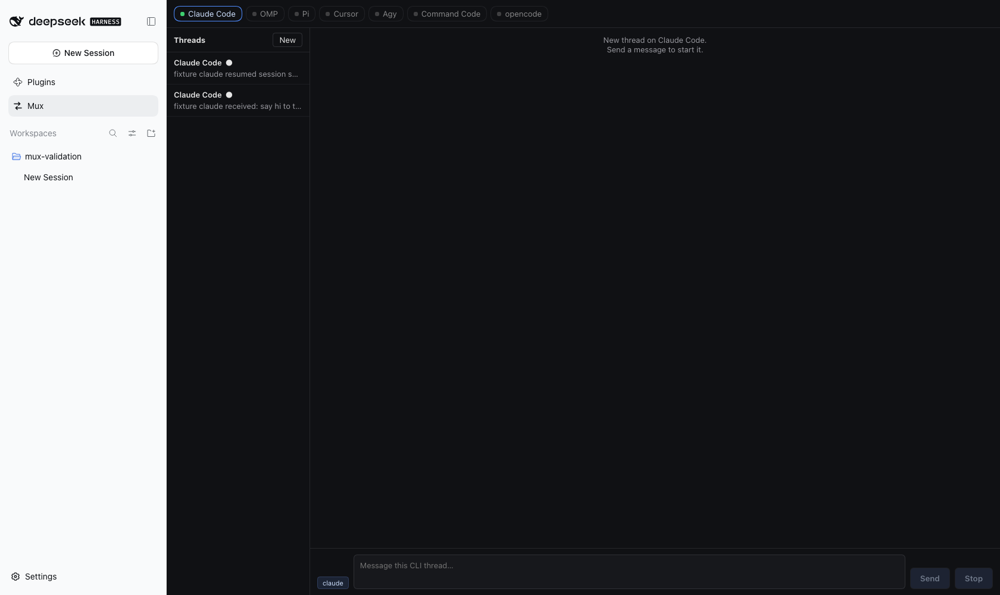

<p align="center">
  
</p>

<p align="center">
  <strong>Talk to other coding CLIs from inside the DeepSeek Harness GUI — and keep the thread.</strong>
</p>

<p align="center">
  <a href="#installation">Install</a> ·
  <a href="#supported-clis">CLIs</a> ·
  <a href="#architecture">Architecture</a> ·
  <a href="#run-in-docker">Docker</a> ·
  <a href="#development">Dev</a> ·
  <a href="#license">License</a>
</p>

<p align="center">
  <a href="https://github.com/FreePeak/dsh-mux/actions/workflows/ci.yml"></a>
  
  
  
  
  
  <a href="LICENSE"></a>
</p>

---

## What it is

**dsh-mux** is a [DeepSeek Harness](https://github.com/deepseek-ai) **external bundle**: a sidebar page, slash commands, a host tool, and a remote service that let you talk to other coding CLIs — Claude Code, OMP, Pi, Cursor, Agy, Command Code, opencode — **from the DSH web GUI**, with each conversation kept alive as a thread.

Instead of switching terminals, open **Mux**, pick a CLI, type a follow-up, and the same CLI session continues where it left off (resume by the CLI's own session id). Stream output in real time, stop a turn in progress, or hand a session id to the model with the **mux** tool.

> This is **not** a standalone server, not a HarnessRouter deployment, and not a live bidirectional PTY. It runs **one CLI process per turn**, resumed by session id.

<p align="center">
  
</p>

## Table of contents

- [Installation](#installation)
- [First run](#first-run)
- [Run in Docker](#run-in-docker)
- [Validation (container)](#validation-container)
- [Supported CLIs](#supported-clis)
- [Architecture](#architecture)
- [How it works](#how-it-works)
- [Configuration](#configuration)
- [Development](#development)
- [Brand assets](#brand-assets)
- [Security](#security)
- [Contributing](#contributing)
- [Changelog](#changelog)
- [License](#license)

## Installation

```bash
# from a clone or release checkout
dsh plugin install /path/to/dsh-mux
```

Installed into the active web profile (patch reload is live on that profile, so
later edits to the bundle are picked up without a full restart).

> Put the target CLI binaries (`claude`, `omp`, `pi`, `cursor`, `agy`,
> `command-code`) on your `PATH`. `opencode` is tracked but reported as
> **missing** until its binary appears.

### Requirements

| | |
| --- | --- |
| Node.js | **≥ 22** (build + tests) |
| Host | DeepSeek Harness web profile (`dsh web`) |
| Optional | Playwright (container drive script) |

## First run

1. Start the GUI (`dsh web` prints `http://127.0.0.1:3081/?token=...`).
2. Click **Mux** in the sidebar — the discovery strip shows which CLIs are installed.
3. Type a message and hit **Send**. The CLI runs non-interactively (accept mode) and streams its reply into the panel and the DSH transcript.
4. Type a follow-up — it resumes the same CLI session id rather than starting fresh.

From the composer:

```text
/mux                  # open the Mux panel
/mux claude say hi    # start a thread; result goes to the transcript
/ask omp explain this # same thing, shorter name
```

## Run in Docker

A self-contained container boots DSH with dsh-mux installed, including a
**fixture `claude` CLI** (`docker/fixtures/claude`) that validates the full
spawn → stdin → session-id → resume pipeline without model credentials:

```bash
docker compose -f docker/docker-compose.yml up --build -d
docker compose -f docker/docker-compose.yml logs -f   # `dsh web:` line has the token
```

Open `http://127.0.0.1:3101/?token=...` (host loopback only — the harness
refuses a wildcard bind, so an in-container relay forwards to its private
`127.0.0.1:3099`).

| | |
| --- | --- |
| Re-seed profile | `FORCE_REINIT=1 docker compose -f docker/docker-compose.yml up -d` |
| Full reset | `docker compose -f docker/docker-compose.yml down -v` |

## Validation (container)

[`scripts/drive.py`](scripts/drive.py) walks the container end-to-end over the
harness wire API (workspace → session → `commands.execute` → panel) and
captures:

| Screenshot | Proves |
| --- | --- |
| [01 · boot / sidebar](docs/screenshots/01-boot-sidebar-mux-entry.png) | Container boots; client bundle loads; **Mux** entry renders |
| [02 · commands](docs/screenshots/02-command-execution-ok.png) | `/mux` + `/ask claude` execute; fixture returns `mux · claude · exit 0` |
| [03 · discovery](docs/screenshots/03-mux-panel-discovery-strip.png) | Panel + discovery strip via `remote.mux.discover()` |
| [04 · thread turns](docs/screenshots/04-mux-panel-thread-turns.png) | Stored thread shows prompt / answer turns |

Full transcript (including the **resume proof** — a second send on the same
thread passes `cliSessionId` to `--resume` and the fixture echoes it back):
[`docs/screenshots/drive.log`](docs/screenshots/drive.log).

```bash
python3 scripts/drive.py "http://127.0.0.1:3101/?token=..."   # needs Playwright
python3 scripts/shot.py  "http://127.0.0.1:3101/?token=..."    # onboarding walkthrough
```

## Supported CLIs

Every adapter keeps the prompt on **stdin**, never in argv, and runs in
non-interactive accept mode so a turn can never block on a prompt nobody can see.

| CLI | First turn | Resume turn | Status |
| --- | --- | --- | --- |
| **Claude Code** | `-p --output-format stream-json` | `--resume <id> -p` | ready |
| **OMP** | `-p --mode json` | `--resume <id> -p` | ready |
| **Pi** | `-p --mode json` | `--resume <id> -p` | ready |
| **Cursor** | `agent -p --output-format stream-json` | `agent --resume <id> -p` | ready |
| **Agy** | `-p --output-format stream-json` | `--conversation <id> -p` | ready |
| **Command Code** | `-p --output-format json --skip-onboarding` | `--resume <id> -p` | ready |
| **opencode** | _(binary missing)_ | _(n/a)_ | missing |

## Architecture

```text
 You ──► DSH Web GUI
            │
     ┌──────┴──────────┐
     ▼                  ▼
 Mux page            DSH agent
 (thread list,       (/mux, /ask,
  composer,          tool mux)
  Send / Stop)
     │                  │
     └────────┬─────────┘
              ▼
         dsh-mux host ──► Thread store (cliSessionId)
              │
              ▼
   Coding CLIs (one process per turn)
```

Interactive diagrams:

- [Architecture](docs/diagrams/dsh-mux-architecture.html)
- [One-turn workflow](docs/diagrams/dsh-mux-turn-workflow.html)
- [Resume sequence](docs/diagrams/dsh-mux-resume-sequence.html)

### Design decisions

- **One CLI process per turn.** Resume is driven by the CLI's own session id —
  uniform across all seven targets without a long-lived RPC pipe.
- **Fail-closed.** Timeouts, empty stdout, or unknown IDs produce clear errors.
  Stop kills the running process (SIGTERM → SIGKILL).
- **Threads persist in JSON** under the profile data dir. Deletion removes the
  mux record only — the CLI's own session files are untouched.
- **The model can drive it.** Tool **mux** accepts `{ tool, prompt, threadId }`
  so an agent can start or continue a thread inside a larger task.
- **Host remote + browser mount.** The page mounts a hand-authored typert
  contribution (`ctx.remote.$mount`) and reads via `ctx.get('remote.mux')`.

## How it works

1. `runTurn` spawns the chosen CLI with print args + permission-mode flag.
2. The prompt is written on **stdin**; stdin is closed; stdout/stderr stream.
3. A session id is parsed from the CLI output and stored on the thread.
4. The next turn feeds that id through the CLI's resume flag.
5. Every result carries a header: `mux · claude · 4.2s · exit 0`.

Default ceilings: **10 minutes** per turn, **1 MiB** combined output.

## Configuration

Host config (schemastery) — all fields are `.default(...)` (no `.optional()`):

| Key | Default | Meaning |
| --- | --- | --- |
| turn timeout | `600000` ms | Wall clock per spawn |
| output cap | `1048576` bytes | Combined stdout + stderr |
| (empty string fields) | `''` | Reserved / path overrides |

See `src/plugin.ts` for the live schema.

## Development

```bash
npm install
npm test          # 28 tests, offline
npm run build     # tsdown → lib/*.mjs
```

| Script | Purpose |
| --- | --- |
| `test` | `node --experimental-strip-types --test test/*.test.ts` |
| `build` | Bundle `src/index.ts` + `src/remote.ts` into `lib/` |

### CI

Every push and pull request to `main` runs [`.github/workflows/ci.yml`](.github/workflows/ci.yml):
`npm ci` → unit tests → build → artifact gates. While the repository is
**private**, jobs run on a self-hosted macOS runner labelled `dsh-mux`
(`~/actions-runners/dsh-mux`, launchd service) so they do not burn the org's
limited hosted Actions minutes. If the repository is made public, switch
`runs-on` back to `ubuntu-latest` **before** opening it — fork PR code must
never execute on a maintainer machine.

### Project layout

```text
dsh-mux/
├── assets/              # logo, mark, favicon, social card
├── package.json         # dsh.bundle + dsh.client, exports (./, ./remote, ./client)
├── cordis.patch.yml     # rows: dsh-mux + dsh-mux-remote
├── client.js            # browser: sidebar + panel + remote contribution
├── docker/              # Dockerfile, compose, entrypoint, fixture claude
├── scripts/drive.py     # container validation + screenshots
├── src/
│   ├── adapters.ts      # seven CLI specs
│   ├── discovery.ts     # PATH strip
│   ├── run.ts           # spawn / stream / cap / kill
│   ├── threads.ts       # JSON thread store
│   ├── commands.ts      # /mux + /ask parser
│   ├── plugin.ts        # host tool + commands (no default export)
│   ├── remote.ts        # host remote (hand-applied @Remote markers)
│   └── index.ts         # cordis entry (named exports only)
├── test/                # 28 tests + artifacts gates
└── docs/                # PRD, diagrams, screenshots, UI sketch
```

Hard-won constraints (also in [CONTRIBUTING.md](CONTRIBUTING.md)):

- Function plugin must **not** `export default` (inject would be stripped).
- No raw `@Remote` in shipped JS — hand-apply markers.
- schemastery: `.default()`, not `.optional()`.
- Browser: `ctx.get('remote.mux')`, not `ctx.remote.mux`.

## Brand assets

| Asset | |
| --- | --- |
|  | [mark.svg](assets/mark.svg) · [favicon.svg](assets/favicon.svg) |
| | [logo.svg](assets/logo.svg) · [logo-dark.svg](assets/logo-dark.svg) |
| | [mark-light.svg](assets/mark-light.svg) · [mark-mono.svg](assets/mark-mono.svg) |
| | [social-card.svg](assets/social-card.svg) (1280×640) |

Two inbound strokes join at a mux node and leave as one outbound trunk with a
green continuity dot — many CLIs in, one resumed thread out. Details:
[assets/README.md](assets/README.md).

## Security

Spawning local CLIs is intentional and constrained: prompt on stdin (never
argv), fail-closed turns, real time/output ceilings. See
[SECURITY.md](SECURITY.md) for the supported versions line and how to report
vulnerabilities **privately**.

## Contributing

Contributions are welcome. Please open an issue before large changes. Read
[CONTRIBUTING.md](CONTRIBUTING.md) and the
[Code of Conduct](CODE_OF_CONDUCT.md).

PR checklist (short form):

- [ ] `npm test` green (28)
- [ ] `npm run build` if host/remote sources changed
- [ ] No new runtime dependency without justification
- [ ] `CHANGELOG.md` updated when behaviour changes

## Changelog

See [CHANGELOG.md](CHANGELOG.md).

## License

[MIT](LICENSE) © FreePeak

---

Built for the DeepSeek Harness ecosystem. Not affiliated with Anthropic, OpenAI,
Cursor, or any of the supported CLIs.
