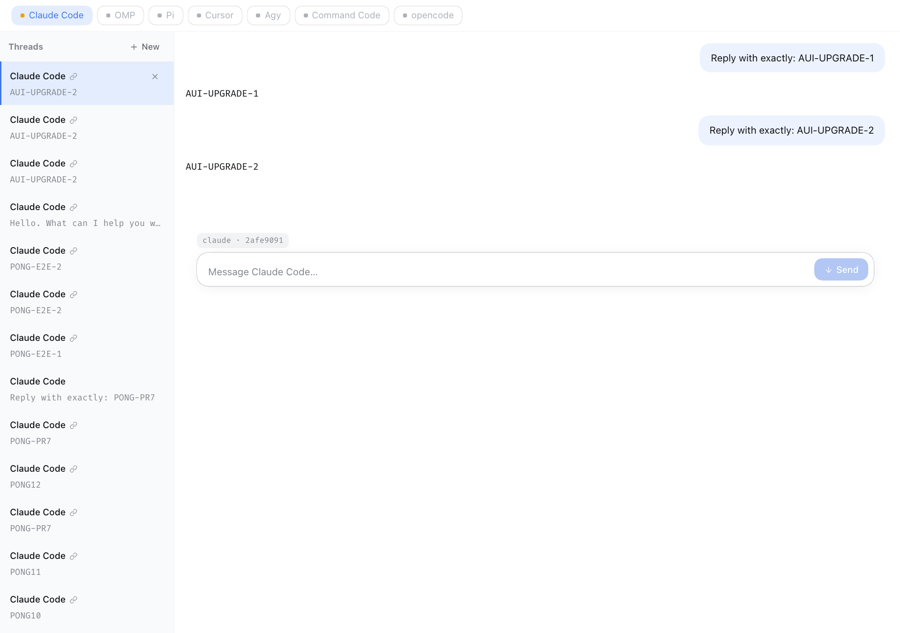

<p align="center">
  
</p>

<p align="center">
  <strong>Talk to your other coding CLIs from inside the DeepSeek Harness GUI — without losing the thread.</strong>
</p>

<p align="center">
  <a href="#installation">Install</a> ·
  <a href="#why">Why</a> ·
  <a href="#supported-clis">CLIs</a> ·
  <a href="#try-it-in-2-minutes-no-credentials-needed">Try it offline</a> ·
  <a href="#architecture">Architecture</a> ·
  <a href="#development">Dev</a> ·
  <a href="#license">License</a>
</p>

<p align="center">
  <a href="https://github.com/FreePeak/dsh-mux/actions/workflows/ci.yml"></a>
  
  
  
  
  <a href="LICENSE"></a>
</p>

<p align="center">
  <a href="https://github.com/FreePeak/dsh-mux/stargazers"></a>
</p>

---

<p align="center">
  
</p>

## What it is

**dsh-mux** is a [DeepSeek Harness](https://github.com/deepseek-ai) **external bundle**. It adds a **Mux** page to the DSH web GUI that lets you talk to other coding CLIs — Claude Code, OMP, Pi, Cursor, Agy, Command Code, opencode — and **keeps the conversation as a thread**.

Open **Mux**, pick a CLI, send a message. The next message in that thread **resumes the same CLI session** instead of starting over, so the CLI keeps its own context. The DSH agent can drive the same threads through the `mux` tool and the `/mux` + `/ask` commands.

> **Scope, honestly:** one CLI process per turn, resumed by the CLI's own session id. It is not a live PTY — output arrives when the turn finishes rather than streaming token-by-token, and there is no in-panel cancel. Claude Code is the only adapter enabled today; the rest are detected and disabled until each has a proven answer parser.

## Why

You already have several coding agents. Running each in its own terminal means losing context every time you switch. dsh-mux keeps each CLI's session id, stores the turn history, and lets you — or your DSH agent — pick a thread back up later, from the same GUI you already live in.

## Installation

```bash
# from a clone or release checkout, into the active DSH profile
dsh plugin install /path/to/dsh-mux
```

Requires **Node.js ≥ 22** and a DSH web profile (`dsh web`). Put the CLI binaries
you want on your `PATH`.

## First run

1. Start the GUI — `dsh web` prints `http://127.0.0.1:3081/?token=...`.
2. Click **Mux** in the sidebar. The strip shows which CLIs are installed and which are enabled.
3. Type a message, hit **Send**. The answer comes back in the panel.
4. Type a follow-up — it resumes the same CLI session.

From the DSH composer:

```text
/mux                  # open the Mux page
/mux claude say hi    # start a thread; result goes to the transcript
/ask omp explain this # same thing, shorter name
```

## Try it in 2 minutes (no credentials needed)

A self-contained Docker setup boots DSH with dsh-mux and a **fixture `claude` CLI**
that exercises the full spawn → stdin → session-id → resume pipeline offline:

```bash
docker compose -f docker/docker-compose.yml up --build -d
docker compose -f docker/docker-compose.yml logs -f   # the `dsh web:` line has the token
```

Then open `http://127.0.0.1:3101/?token=...` (host loopback only).

| | |
| --- | --- |
| Re-seed profile | `FORCE_REINIT=1 docker compose -f docker/docker-compose.yml up -d` |
| Full reset | `docker compose -f docker/docker-compose.yml down -v` |

## Supported CLIs

Every adapter keeps the prompt on **stdin**, never in argv, and runs in
non-interactive accept mode so a turn can never block on a prompt nobody can see.

| CLI | First turn | Resume turn | Status |
| --- | --- | --- | --- |
| **Claude Code** | `-p --output-format stream-json` | `--resume <id> -p` | **enabled** |
| **OMP** | `-p --mode json` | `--resume <id> -p` | detected, disabled |
| **Pi** | `-p --mode json` | `--resume <id> -p` | detected, disabled |
| **Cursor** | `agent -p --output-format stream-json` | `agent --resume <id> -p` | detected, disabled |
| **Agy** | `-p --output-format stream-json` | `--conversation <id> -p` | detected, disabled |
| **Command Code** | `-p --output-format json --skip-onboarding` | `--resume <id> -p` | detected, disabled |
| **opencode** | _(binary missing)_ | _(n/a)_ | missing, disabled |

Only **Claude Code** is enabled for send/select (`ENABLED_ADAPTER_IDS`). Its
`stream-json` NDJSON is parsed down to the final result text before it is stored
as the thread answer — that parsing is why it is first. Adding another CLI means
giving it the same answer-parsing treatment; see [CONTRIBUTING.md](CONTRIBUTING.md).

## Architecture

```text
  You ──► DSH Web GUI
             │
      ┌──────┴──────────┐
      ▼                  ▼
  Mux page            DSH agent
  (thread rail,       (/mux, /ask,
   composer,           tool mux)
   Send)
      │                  │
      └────────┬─────────┘
               ▼
          dsh-mux host ──► Thread store (cliSessionId)
               │
               ▼
    Coding CLIs (one process per turn)
```

Interactive diagrams:

- [Architecture](docs/diagrams/dsh-mux-architecture.html)
- [One-turn workflow](docs/diagrams/dsh-mux-turn-workflow.html)
- [Resume sequence](docs/diagrams/dsh-mux-resume-sequence.html)

### Design decisions

- **One CLI process per turn.** Resume is driven by the CLI's own session id —
  uniform across all seven targets without a long-lived RPC pipe.
- **Fail-closed.** Timeouts, empty stdout, or unknown IDs produce clear errors.
  A host-side cancel kills the process (SIGTERM → SIGKILL).
- **Threads persist in JSON** under the profile data dir. Deletion removes the
  mux record only — the CLI's own session files are untouched.
- **The model can drive it.** Tool **mux** accepts `{ tool, prompt, threadId }`
  so an agent can start or continue a thread inside a larger task.
- **Built on assistant-ui primitives.** The panel is `ExternalStoreRuntime` plus
  `Thread` / `Composer` / `Message` / `ActionBar` primitives, and it inherits the
  host chat's own theme tokens, so it looks native in light and dark.

## How it works

1. `runTurn` spawns the chosen CLI with print args + permission-mode flag.
2. The prompt is written on **stdin**; stdin is closed; stdout/stderr are captured.
3. A session id is parsed from the CLI output and stored on the thread.
4. The next turn feeds that id through the CLI's resume flag.
5. Every result carries a header: `mux · claude · 4.2s · exit 0`.

Default ceilings: **10 minutes** per turn, **1 MiB** combined output.

## Configuration

Host config (schemastery) — all fields are `.default(...)` (no `.optional()`):

| Key | Default | Meaning |
| --- | --- | --- |
| turn timeout | `600000` ms | Wall clock per spawn |
| output cap | `1048576` bytes | Combined stdout + stderr |
| (empty string fields) | `''` | Reserved / path overrides |

See `src/plugin.ts` for the live schema.

## Development

```bash
npm install
npm test             # 43 tests, offline, no model credentials needed
npm run build        # tsdown → lib/*.mjs
npm run build:client # esbuild → client.js (the ./client export)
```

| Script | Purpose |
| --- | --- |
| `test` | `node --experimental-strip-types --test test/*.test.ts` |
| `build` | Bundle `src/index.ts` + `src/remote.ts` into `lib/` |
| `build:client` | Bundle `web/` into the browser `./client` export |

### CI

[`.github/workflows/ci.yml`](.github/workflows/ci.yml) runs on every push and
pull request: `npm ci` → unit tests → build → artifact gates. The suite is fully
offline — it needs no CLI binaries and no harness profile.

### Project layout

```text
dsh-mux/
├── assets/              # logo, mark, favicon, social card
├── package.json         # dsh.bundle + dsh.client, exports (./, ./remote, ./client)
├── cordis.patch.yml     # rows: dsh-mux + dsh-mux-remote
├── client.js            # built browser bundle (generated — edit web/ instead)
├── web/                 # client source: entry.tsx + tokens.css + esbuild build
├── docker/              # Dockerfile, compose, entrypoint, fixture claude
├── scripts/             # container drive + screenshot helpers, release script
├── src/
│   ├── adapters.ts      # seven CLI specs + the enablement allowlist
│   ├── discovery.ts     # PATH strip
│   ├── parse-answer.ts  # stream-json → answer text
│   ├── run.ts           # spawn / capture / cap / kill
│   ├── threads.ts       # JSON thread store
│   ├── commands.ts      # /mux + /ask parser
│   ├── plugin.ts        # host tool + commands (no default export)
│   ├── remote.ts        # host remote (hand-applied @Remote markers)
│   └── index.ts         # cordis entry (named exports only)
├── test/                # 43 tests + artifact gates
└── docs/                # PRD, diagrams, screenshots, UI sketch
```

Hard-won constraints (also in [CONTRIBUTING.md](CONTRIBUTING.md)):

- Function plugin must **not** `export default` (inject would be stripped).
- No raw `@Remote` in shipped JS — hand-apply markers.
- schemastery: `.default()`, not `.optional()`.
- Browser: `ctx.get('remote.mux')`, not `ctx.remote.mux`.
- The client bundle is **generated** — edit `web/`, run `npm run build:client`.

## Brand assets

| Asset | |
| --- | --- |
|  | [mark.svg](assets/mark.svg) · [favicon.svg](assets/favicon.svg) |
| | [logo.svg](assets/logo.svg) · [logo-dark.svg](assets/logo-dark.svg) |
| | [mark-light.svg](assets/mark-light.svg) · [mark-mono.svg](assets/mark-mono.svg) |
| | [social-card.svg](assets/social-card.svg) (1280×640) |

Two inbound strokes join at a mux node and leave as one outbound trunk with a
green continuity dot — many CLIs in, one resumed thread out. Details:
[assets/README.md](assets/README.md).

## Security

Spawning local CLIs is intentional and constrained: the prompt goes on stdin
(never argv), turns fail closed, and time/output ceilings are real. See
[SECURITY.md](SECURITY.md) for the supported versions line and how to report
vulnerabilities **privately**.

## Contributing

Contributions are welcome — the easiest high-value contribution is **another CLI
adapter with a proven answer parser** (see [Supported CLIs](#supported-clis)).
Please open an issue before large changes. Read [CONTRIBUTING.md](CONTRIBUTING.md)
and the [Code of Conduct](CODE_OF_CONDUCT.md).

PR checklist (short form):

- [ ] `npm test` green (43)
- [ ] `npm run build` if host/remote sources changed
- [ ] `npm run build:client` if `web/` changed
- [ ] No new runtime dependency without justification
- [ ] `CHANGELOG.md` updated when behaviour changes

## Changelog

See [CHANGELOG.md](CHANGELOG.md).

## License

[MIT](LICENSE) © FreePeak

---

Built for the DeepSeek Harness ecosystem. Not affiliated with Anthropic, OpenAI,
Cursor, or any of the supported CLIs.
